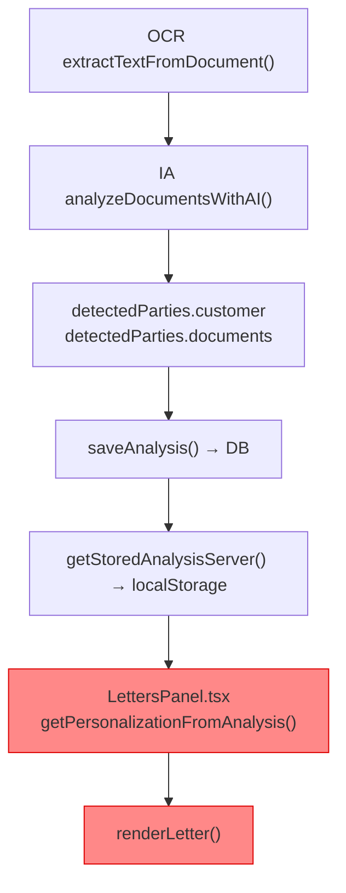
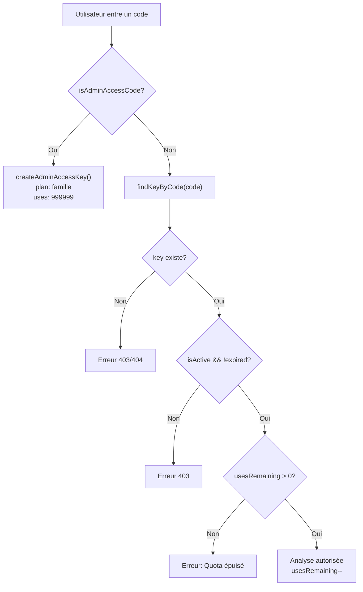
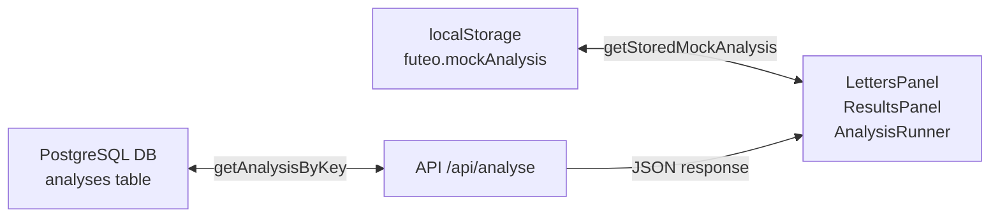
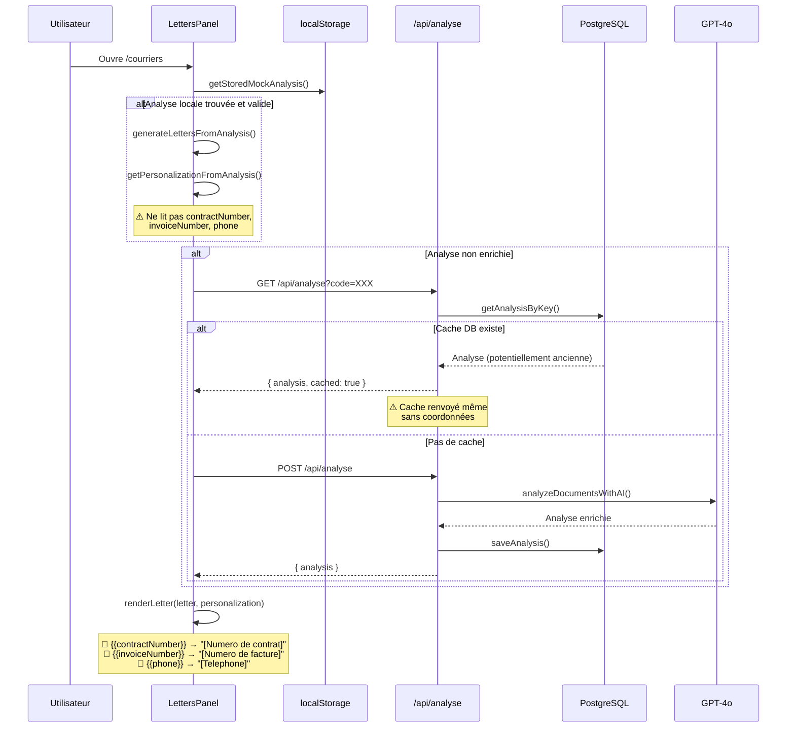

# 🔍 Audit Diagnostic — Foyer Futé

> **Date** : 16 mai 2026  
> **Mode** : DIAGNOSTIC UNIQUEMENT — Aucun fichier modifié  
> **Périmètre** : Régressions des ~2 derniers jours

---

## Résumé exécutif

L'audit révèle **3 problèmes distincts** avec des causes différentes. Aucun ne provient de l'OCR, de la DB, ou d'un mock/fallback actif en production. Les causes principales sont :

| # | Problème | Cause racine | Sévérité |
|---|----------|-------------|----------|
| 1 | Placeholders visibles dans les courriers | Nouveaux champs ajoutés au template sans source de données côté frontend | 🔴 Haute |
| 2 | Seulement 3 offres comparatives | Filtre `.slice(0, 8)` + dépendance à la catégorie/sous-catégorie des expenses | 🟡 Moyenne |
| 3 | Coordonnées client absentes | Cache DB renvoyé trop tôt + analyse IA aléatoire sur l'extraction des coordonnées | 🔴 Haute |

---

## 1. COURRIERS — Placeholders visibles

### 1.1 Constat

Les courriers affichent :
- `[Prenom]`, `[Nom]`, `[Adresse]`, `[Numero client]`, `[Email]`
- Mais aussi les **nouveaux** : `[Numero de contrat]`, `[Numero de facture]`, `[Telephone]`

### 1.2 Cause racine identifiée

Le commit récent [a956597 + lettres diff](file:///c:/Users/primate/Documents/foyer%20fut%C3%A9/features/letters/service.ts) a ajouté **3 nouveaux champs** au template de courrier :

```diff
+ "Numero de contrat : {{contractNumber}}",
+ "Numero de facture : {{invoiceNumber}}",
+ "Telephone : {{phone}}",
```

Et le `renderLetter()` (L602-613) les remplace par des fallbacks visibles quand ils sont vides :

```typescript
.replaceAll("{{contractNumber}}", values.contractNumber || "[Numero de contrat]")
.replaceAll("{{invoiceNumber}}", values.invoiceNumber || "[Numero de facture]")
.replaceAll("{{phone}}", values.phone || "[Telephone]")
```

### 1.3 Chaîne de données — Où se perdent les coordonnées



> [!IMPORTANT]
> **Le problème principal est en 2 parties :**
> 
> **Partie A — Cache DB** : La route `POST /api/analyse` (L96-104) renvoie l'analyse en cache si elle existe ET correspond aux documents, même si les coordonnées sont vides. L'ancienne version (avant le fix `bfc3556`) renvoyait le cache dès que `existingAnalysis?.detectedParties?.documents` existait — même sans vérifier le contenu. La nouvelle version est meilleure mais renvoie toujours un cache **ancien** qui ne contient peut-être pas les coordonnées.
>
> **Partie B — Frontend** : `getPersonalizationFromAnalysis()` dans [LettersPanel.tsx:L64-83](file:///c:/Users/primate/Documents/foyer%20fut%C3%A9/features/letters/LettersPanel.tsx#L64-L83) cherche les coordonnées dans `detectedParties.customer` puis dans `detectedParties.documents[*].customer`. Si l'analyse IA n'a pas rempli ces champs (ou si l'OCR n'a pas extrait assez de texte), tout reste vide.

### 1.4 Pourquoi les anciens champs (Prénom, Nom, Adresse) sont aussi vides

Le `LettersPanel` (L147-212) a une logique complexe de chargement en cascade :

1. Lit `localStorage` (`getStoredMockAnalysis`)
2. Si pas d'analyse enrichie → appelle le serveur (`getStoredAnalysisServer`)
3. Si le serveur n'a pas d'analyse enrichie → lance `refreshStoredAnalysisServer` (POST `/api/analyse`)
4. Si tout échoue → fallback local avec `generateMockAnalysisFromDocuments`

**Le problème** : `generateMockAnalysisFromDocuments()` dans [service.ts:L315-372](file:///c:/Users/primate/Documents/foyer%20fut%C3%A9/features/analysis/service.ts#L315-L372) **ne remplit JAMAIS les coordonnées client**. Elle construit `buildDetectedParties()` qui ne contient que les fournisseurs, pas le client.

> [!WARNING]
> **Si le LettersPanel retombe sur le mock local** (cas fréquent si la connexion serveur échoue ou si l'analyse serveur est vide), les coordonnées sont **toujours vides** par design.

### 1.5 Fichiers impliqués

| Fichier | Rôle dans le problème |
|---------|----------------------|
| [service.ts (letters)](file:///c:/Users/primate/Documents/foyer%20fut%C3%A9/features/letters/service.ts#L237-L279) | Template avec nouveaux placeholders `{{contractNumber}}` `{{invoiceNumber}}` `{{phone}}` |
| [service.ts (letters) L578-614](file:///c:/Users/primate/Documents/foyer%20fut%C3%A9/features/letters/service.ts#L578-L614) | `renderLetter()` — fallback `[Numero de contrat]` etc. |
| [LettersPanel.tsx L64-83](file:///c:/Users/primate/Documents/foyer%20fut%C3%A9/features/letters/LettersPanel.tsx#L64-L83) | `getPersonalizationFromAnalysis()` — ne lit PAS `contractNumber`, `invoiceNumber`, `phone` |
| [service.ts (analysis) L315-372](file:///c:/Users/primate/Documents/foyer%20fut%C3%A9/features/analysis/service.ts#L315-L372) | `generateMockAnalysisFromDocuments()` — ne génère pas de customer |
| [route.ts (analyse) L96-104](file:///c:/Users/primate/Documents/foyer%20fut%C3%A9/app/api/analyse/route.ts#L96-L104) | Cache renvoyé trop facilement |

---

## 2. COMPARATIFS — Seulement 3 offres

### 2.1 Constat

L'utilisateur voit ~3 offres au lieu de davantage.

### 2.2 Analyse du code

La fonction `findAlternativeOffers()` dans [recommendations/service.ts:L146-181](file:///c:/Users/primate/Documents/foyer%20fut%C3%A9/features/recommendations/service.ts#L146-L181) :

```typescript
export function findAlternativeOffers(expenses: Expense[]): AlternativeOffer[] {
  return expenses
    .flatMap((expense) => {
      const templates = (alternativesByCategory[expense.category] ?? []).filter(
        (template) =>
          !template.subcategories ||
          !expense.subcategory ||
          template.subcategories.includes(expense.subcategory)
      );
      return templates.map(/* ... */);
    })
    .sort((a, b) => b.estimatedYearlySaving - a.estimatedYearlySaving)
    .slice(0, 8);  // ← Maximum 8 offres
}
```

### 2.3 Cause racine

Le nombre d'offres affichées dépend **directement du nombre d'expenses et de leurs catégories** :

| Catégorie | Offres disponibles dans le code | Filtre sous-catégorie |
|-----------|------|--------|
| ENERGY | 2 | Aucun |
| TELECOM / INTERNET | 2 | `subcategories: [INTERNET]` |
| TELECOM / MOBILE | 3 | `subcategories: [MOBILE]` |
| INSURANCE | 2 | Aucun |
| SUBSCRIPTIONS | 1 | Aucun |
| BANKING | 1 | Aucun |

**Total offres dans le code : 11 templates**, mais le résultat final est limité à `slice(0, 8)`.

> [!IMPORTANT]
> **Le commit `9195fb8` a retiré le filtre `.filter((offer) => offer.estimatedYearlySaving > 0)`** qui excluait les offres sans économie. C'est une amélioration. Mais le nombre d'offres affiché dépend du nombre d'expenses dans l'analyse.

**Si l'analyse ne contient que 1-2 expenses** (par exemple parce que l'IA n'a détecté que 2 postes), alors le nombre d'offres sera mécaniquement limité :
- 1 expense TELECOM/MOBILE → 3 offres mobile
- 1 expense ENERGY → 2 offres énergie
- Total = 5 offres max

**Si l'analyse ne contient qu'1 expense (mock ou IA)** → seulement 2-3 offres.

### 2.4 Le vrai problème : résultat dépendant de l'analyse

Le `ResultsPanel.tsx` (L46-77) appelle `/api/alternatives` en POST avec `expenses` depuis l'analyse stockée. Si l'analyse est un **mock local** (pas d'IA), les expenses sont génériques et peu nombreuses.

De plus, le `ResultsPanel` affiche en parallèle les `bestAlternativeByCategory` (L112-127) qui ne garde **qu'une seule offre par catégorie** pour la section "Postes à comparer".

### 2.5 Verdict

| Aspect | État |
|--------|------|
| Le code des offres | ✅ 11 templates, plafond 8 |
| Le filtre récemment retiré | ✅ Correction OK (commit 9195fb8) |
| Nombre d'offres visible | ⚠️ Dépend du nombre d'expenses dans l'analyse |
| Cause probable | L'analyse active est un mock ou contient peu d'expenses |
| Frontend restriction de plan | ❌ Aucune restriction de plan sur les alternatives |

---

## 3. ACCÈS UTILISATEUR / DÉCOUVERTE GRATUITE

### 3.1 Logique actuelle

Voici comment la logique d'accès fonctionne :



### 3.2 Changements récents dans access-keys.ts

Le diff montre ces modifications récentes :

1. **`validateAccessKey()` ne vérifie plus `usesRemaining`** (L217) :
   ```diff
   - if (!key || !key.isActive || key.usesRemaining <= 0) {
   + if (!key || !key.isActive) {
   ```
   → Cela signifie que côté **client** (localStorage), une clé avec `usesRemaining = 0` est encore considérée valide. **Mais côté serveur** (`POST /api/analyse` L87), le quota est toujours vérifié :
   ```typescript
   if (!key.isActive || key.usesRemaining <= 0) {
     return NextResponse.json({ error: "Quota épuisé" }, { status: 403 });
   }
   ```

2. **`generateAccessKey()` ne marque plus `hasUsedFreeTrial: true`** pour les clés découverte :
   ```diff
   - hasUsedFreeTrial: plan === "decouverte",
   - freeTrialUsedAt: plan === "decouverte" ? new Date().toISOString() : undefined
   + hasUsedFreeTrial: false
   ```

3. **`storeAccessKey()` purge le localStorage** quand on change de clé (L278-290), ce qui efface `uploadedDocuments` et `mockAnalysis`.

### 3.3 Impact sur les fonctionnalités

| Aspect | Impacté ? | Détail |
|--------|-----------|--------|
| Courriers | ⚠️ Indirectement | Si la clé est `decouverte`, aucune restriction spécifique dans le code courrier. Mais le plan `decouverte` offre `usesRemaining: 1` → après 1 analyse, quota épuisé côté serveur |
| Comparatifs | ❌ Non | `findAlternativeOffers()` ne vérifie aucun plan |
| Résultats | ❌ Non | `ResultsPanel` ne vérifie aucun plan |
| Exports PDF | ❌ Non | `jsPDF` est côté client, pas de vérification de plan |
| Discovery plan items | ⚠️ | Le texte marketing dit "Sans courrier complet" et "Sans rapport complet" mais **aucune restriction n'est codée** |

> [!NOTE]
> La logique "découverte gratuite" fonctionne correctement côté serveur (`/api/free-access`). Le problème `hasUsedFreeTrial` est **cosmétique** : il n'est jamais vérifié dans la logique d'accès.

### 3.4 Le vrai risque

La suppression de la vérification `usesRemaining <= 0` dans `validateAccessKey()` signifie qu'un utilisateur avec un quota épuisé peut encore naviguer dans l'application **côté client** (les pages se chargent, le localStorage est lu). Mais l'appel serveur POST `/api/analyse` échouera avec un 403. Cela crée un état incohérent où l'utilisateur voit des données anciennes (du cache) mais ne peut pas relancer d'analyse.

---

## 4. CACHE / DONNÉES OBSOLÈTES

### 4.1 Double cache problématique



**Problème identifié** : L'analyse dans la DB peut être périmée (anciens documents) ou incomplète, mais elle est servie quand les IDs des documents matchent. La vérification `isNonEmptyAnalysis()` (L35-51 de route.ts) est correcte mais **une analyse ancienne qui avait des expenses mais pas de coordonnées sera toujours considérée comme valide**.

### 4.2 Scénario de perte de coordonnées via cache

1. L'utilisateur uploade 2 documents
2. L'analyse IA tourne → coordonnées extraites (ou pas, selon la qualité OCR) → sauvée en DB
3. L'utilisateur revient 2h plus tard → le cache DB est renvoyé tel quel
4. Les coordonnées manquantes du 1er passage restent manquantes
5. L'utilisateur ajoute le handler DELETE `/api/analyse?code=XXX` mais **ne l'utilise pas** avant de recharger les courriers

> [!WARNING]
> **Le cache DB empêche une re-extraction même si le prompt IA a été amélioré (commit a956597).** L'ancien résultat est toujours renvoyé.

---

## 5. MOCKS / FALLBACKS

### 5.1 État actuel

| Fonction | Fichier | Est-elle utilisée ? | Quand ? |
|----------|---------|---------------------|---------|
| `generateMockAnalysisFromDocuments()` | [service.ts L315](file:///c:/Users/primate/Documents/foyer%20fut%C3%A9/features/analysis/service.ts#L315) | ✅ **OUI** | Fallback quand le serveur est injoignable ou l'analyse serveur absente |
| `analyzeDocumentsStub()` | [service.ts L13](file:///c:/Users/primate/Documents/foyer%20fut%C3%A9/features/analysis/service.ts#L13) | ❌ Non | Jamais appelée nulle part |
| `generateRecommendationsStub()` | [recommendations/service.ts L10](file:///c:/Users/primate/Documents/foyer%20fut%C3%A9/features/recommendations/service.ts#L10) | ❌ Non | Jamais appelée nulle part |
| `generateLetterDraftStub()` | [letters/service.ts L30](file:///c:/Users/primate/Documents/foyer%20fut%C3%A9/features/letters/service.ts#L30) | ❌ Non | Jamais appelée nulle part |
| `analyzeDocumentsWithAI()` | [ai-service.ts L43](file:///c:/Users/primate/Documents/foyer%20fut%C3%A9/features/analysis/ai-service.ts#L43) | ✅ OUI | Analyse IA réelle via GPT-4o |

### 5.2 Le mock actif est `generateMockAnalysisFromDocuments()`

Ce mock est activement utilisé dans :
- [AnalysisRunner.tsx L65](file:///c:/Users/primate/Documents/foyer%20fut%C3%A9/features/analysis/AnalysisRunner.tsx#L65) : fallback quand aucune analyse stockée
- [LettersPanel.tsx L171](file:///c:/Users/primate/Documents/foyer%20fut%C3%A9/features/letters/LettersPanel.tsx#L171) : fallback quand aucune analyse correspondante

**Ce mock ne génère PAS de coordonnées client**, ce qui explique directement les placeholders visibles quand il est utilisé.

### 5.3 Offres fictives ?

Les offres dans `recommendations/service.ts` sont **statiques** (pas de données temps réel). Elles sont codées en dur (Énergie Verte, Fibre Maison, Free Mobile, B&You, Sosh, Assur Habitat, etc.). Ce n'est pas une régression — c'était déjà le cas il y a 2 jours.

---

## 6. RAPPORT FINAL

### ✅ Ce qui fonctionne encore correctement

| Fonctionnalité | État |
|---------------|------|
| OCR PDF (pdf-parse) | ✅ Fonctionnel |
| OCR images (GPT-4o Vision) | ✅ Fonctionnel |
| Upload documents → DB + stockage fichiers | ✅ Fonctionnel |
| Analyse IA (GPT-4o) | ✅ Fonctionnel (quand lancée) |
| Extraction des coordonnées (document-profiles.ts) | ✅ Regex fonctionnelles |
| Sauvegarde analyse en DB | ✅ Fonctionnel |
| Stripe checkout | ✅ Fonctionnel |
| Envoi clé gratuite par email (Brevo) | ✅ Fonctionnel |
| Export PDF courriers (jsPDF) | ✅ Fonctionnel |
| Validation/activation clés | ✅ Fonctionnel |
| Handler DELETE analyse (purge cache) | ✅ Ajouté dans bfc3556 |

### 🔴 Ce qui est réellement cassé

| # | Problème | Cause exacte |
|---|----------|-------------|
| 1 | **Placeholders `[Numero de contrat]`, `[Numero de facture]`, `[Telephone]`** toujours visibles | Nouveaux champs ajoutés au template de courrier sans que `getPersonalizationFromAnalysis()` dans le frontend ne les alimente. De plus, ces champs ne sont PAS dans le type `LetterPersonalization`. |
| 2 | **Placeholders `[Prenom]`, `[Nom]`, `[Adresse]`** toujours visibles | L'analyse utilisée est soit un mock local (pas de customer), soit un cache DB ancien qui n'a pas de coordonnées. |

### 🟡 Ce qui est dégradé

| # | Problème | Cause exacte |
|---|----------|-------------|
| 3 | Comparatifs avec peu d'offres | Dépend du nombre d'expenses dans l'analyse active. Si l'analyse est un mock ou contient peu d'expenses, peu d'offres sont générées. Le filtre `estimatedYearlySaving > 0` a été correctement retiré. |
| 4 | Cache empêche de bénéficier des améliorations du prompt IA | Le cache DB renvoie l'ancienne analyse tant que les IDs de documents matchent, même si le prompt a été amélioré. |

### 📅 Régressions probables des 2 derniers jours

| Commit | Date | Changement | Impact |
|--------|------|-----------|--------|
| `a956597` | 16 mai 10:08 | Prompt IA enrichi + indentation | ⚠️ Amélioration qui ne s'applique pas aux analyses en cache |
| `bfc3556` | 16 mai (avant) | Ajout handler DELETE analyse + purge DB | ✅ Correction — mais pas utilisé automatiquement |
| `9195fb8` | 16 mai 05:48 | Retrait filtre `estimatedYearlySaving > 0` | ✅ Correction — mais pas suffisant si peu d'expenses |
| `3470df3` | ~15 mai | Merge corrections locales OCR et analyse | Changements OCR importants |
| `919ff2a` | ~15 mai | Fix OCR pdf-parse, import circulaire, hydratation | Changement majeur OCR |

**Le changement le plus impactant** est probablement `919ff2a` (fix OCR pdf-parse) qui a pu modifier le `physicalFileName` résolu par `extractTextFromDocument()`. Si le nom physique calculé ne correspond plus au fichier stocké, l'OCR retourne une chaîne vide → l'IA n'a rien à analyser → pas de coordonnées.

### 🎯 Fichiers les plus suspects

1. 🔴 [features/letters/service.ts](file:///c:/Users/primate/Documents/foyer%20fut%C3%A9/features/letters/service.ts) — Nouveaux placeholders sans source de données
2. 🔴 [features/letters/LettersPanel.tsx](file:///c:/Users/primate/Documents/foyer%20fut%C3%A9/features/letters/LettersPanel.tsx) — `getPersonalizationFromAnalysis()` ne lit pas les nouveaux champs
3. 🟡 [app/api/analyse/route.ts](file:///c:/Users/primate/Documents/foyer%20fut%C3%A9/app/api/analyse/route.ts) — Cache trop agressif
4. 🟡 [features/analysis/service.ts](file:///c:/Users/primate/Documents/foyer%20fut%C3%A9/features/analysis/service.ts) — Mock sans coordonnées client

### 🏷 Causes probables exactes

| Source | Est-ce la cause ? | Explications |
|--------|-------------------|-------------|
| OCR | ❌ Non | OCR fonctionne (pdf-parse + Vision). Vérifié dans le code. |
| IA | ⚠️ Partiellement | L'IA peut ne pas extraire les coordonnées si le texte OCR est pauvre. Mais le prompt a été amélioré. |
| Cache | 🔴 **OUI** | Le cache DB renvoie une vieille analyse sans coordonnées |
| Plans/restrictions | ❌ Non | Aucune restriction de plan sur les courriers ou comparatifs |
| Frontend | 🔴 **OUI** | `getPersonalizationFromAnalysis()` incomplet + fallback mock sans customer |
| DB | ❌ Non | DB fonctionne correctement |
| Mocks | 🔴 **OUI** | `generateMockAnalysisFromDocuments()` est utilisé en fallback et ne contient pas de client |
| Recommandations | 🟡 Partiellement | Nombre d'offres limité par le nombre d'expenses |
| Courriers (template) | 🔴 **OUI** | Nouveaux placeholders sans alimentation |

### 🚀 Ce qui doit être corrigé EN PRIORITÉ

1. **[PRIORITÉ 1]** `renderLetter()` + `buildBodyTemplate()` — Les placeholders `{{contractNumber}}`, `{{invoiceNumber}}`, `{{phone}}` doivent être conditionnels (ne pas afficher la ligne si vide, au lieu de montrer `[Numero de contrat]`)
2. **[PRIORITÉ 1]** `getPersonalizationFromAnalysis()` dans `LettersPanel.tsx` — Doit aussi lire `contractNumber`, `invoiceNumber`, `phone` depuis le `customerProfile` de l'analyse
3. **[PRIORITÉ 2]** Cache DB — Permettre un re-calcul automatique quand le prompt IA a changé, ou exposer le bouton "Relancer l'analyse" plus visiblement
4. **[PRIORITÉ 2]** `generateMockAnalysisFromDocuments()` — Devrait tenter d'extraire un minimum de coordonnées client depuis les noms de fichiers ou les métadonnées disponibles
5. **[PRIORITÉ 3]** Ajouter un indicateur visuel clair quand l'analyse est un mock local vs une analyse IA enrichie

### 🛑 Ce qui ne doit surtout PAS être touché

- `lib/server/ocr.ts` — Fonctionne correctement, modifications récentes stabilisées
- `lib/server/db.ts` — Schéma DB et ORM stables
- `features/analysis/document-profiles.ts` — Regex d'extraction bien écrites
- `features/billing/service.ts` — Stripe integration stable
- `app/api/webhooks/stripe/route.ts` — Ne pas toucher au webhook
- `app/api/free-access/route.ts` — Logique de trial gratuit correcte
- `drizzle.config.ts` / migrations — Ne pas relancer de migration

---

## Annexe : Flux complet des données courrier


